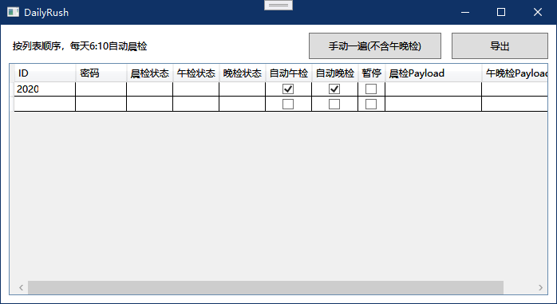
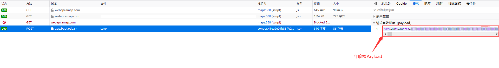

# BUPTRushReport

> 北京邮电大学疫情防控通自动填报工具，包含晨检（每日填报）、午晚检

## 我想说的

我是20级新生，目前尚未入学只需要每日填报，尚不明确午晚检的具体时间段和规则，所以程序还只是在测试阶段。如果有已在校并且了解午晚检政策、规则的同学想帮助我改进程序，欢迎邮件告诉我哦，真的非常感谢！

## 界面示意



## 运行

本程序是基于Dot Net Core 3.1运行时的WPF应用，运行本程序需要```Desktop Runtime 3.1.x```的支持。

在这里寻找```Desktop Runtime 3.1.x```: [Download .NET Core 3.1](https://dotnet.microsoft.com/download/dotnet-core/3.1)

## 使用方法

双击列表框中最后一行即可新增行

按钮“手动一遍(不含午晚检)”：按列表顺序进行每日填报（晨检）

**若程序启动时同一目录下有"userlist.xml"文件，程序将自动识别导出配置内容，并填充列表框**

按钮“导出”：将列表导出到配置文件"userlist.xml"

各列示意：

- ID：学（工）号
- 密码：学（工）号对应的密码
- 晨检状态（只读）：自动晨检执行结果
- 午检状态（只读）：自动午检执行结果
- 晚检状态（只读）：自动晚检执行结果
- 自动午检：在默认时间（15:10）进行午检填报
- 自动晚检：在默认时间（19:50）进行晚检填报
- 暂停：跳过本条目，不进行本条的任何自动填报
- 晨检Payload：每日填报（晨检）需要Post的数据内容
- 午晚检Payload：午晚检需要Post的数据内容

### 如何获取晨检Payload？

1. 用电脑端浏览器打开[每日填报页面](https://app.bupt.edu.cn/ncov/wap/default/index)

2. 在每日填报中填写好需要提交的所有信息，填好后不要提交

3. 呼出浏览器控制台，运行下面的JS即可得到晨检Payload:

   **注意：不含开头的"payload:"**
   
   ```javascript
   var s = "";
   for (var i in vm.info){
     s += i + "=" + encodeURIComponent(vm.info[i]) + "&";
   }
   s = s.replaceAll("%20", "+");
   s = s.substring(0, s.length-1);
   alert("payload: \n" + s);
   ```

### 如何获取午晚检Payload？

1. 用电脑端浏览器打开[晨午晚检页面](https://app.bupt.edu.cn/site/ncov/xisudailyup)

2. 在晨午晚检中填写好需要提交的所有信息，填好后不要提交

3. 呼出浏览器控制台，切换到网络选项卡(Network)

4. 点击提交信息，查看网络选项卡(Network)中URL为：```https://app.bupt.edu.cn/xisuncov/wap/open-report/save```的POST请求内容，这个字符串就是午晚检Payload

   

## 敬告

仅供学习交流使用，请勿用于非法用途。

